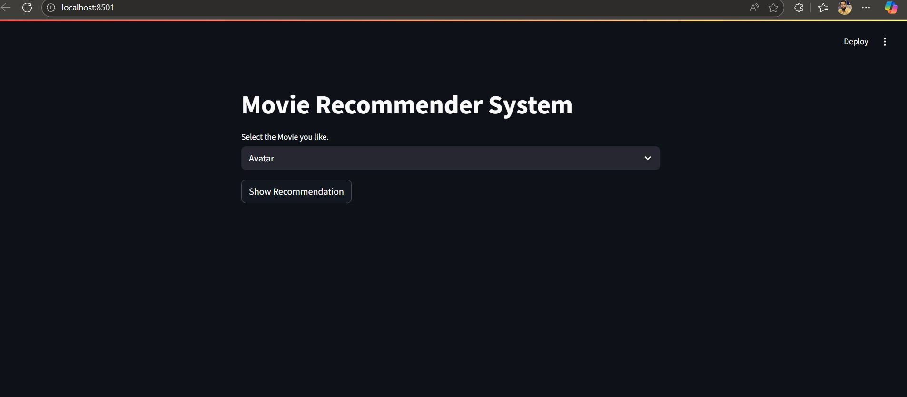
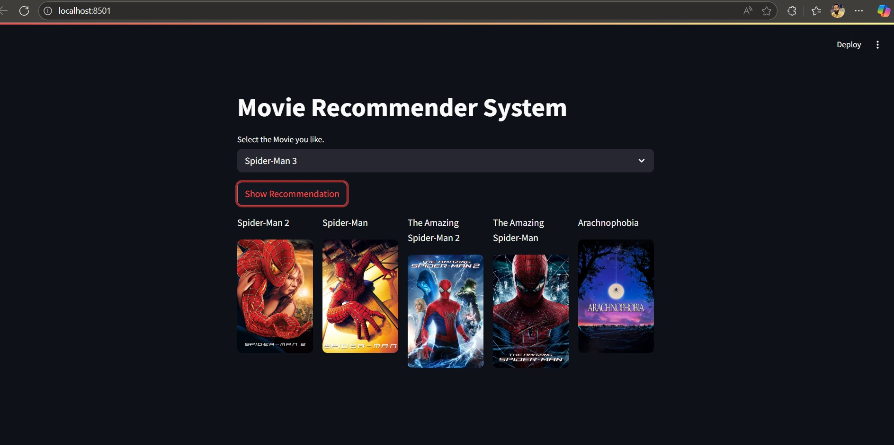

# Movie Recommender System

A content-based movie recommendation system built with Streamlit that suggests similar movies based on your selection. The system uses machine learning to analyze movie similarities and fetches movie posters from The Movie Database (TMDB) API.


## 🎬 Features

- **Interactive UI**: Clean and intuitive interface built with Streamlit
- **Smart Recommendations**: Get 9 similar movie recommendations based on your selection
- **Visual Experience**: Display movie posters fetched from TMDB API
- **Robust Error Handling**: Includes retry mechanism for API calls
- **Fast Performance**: Pre-computed similarity matrix for instant recommendations

## 🚀 Demo

### Main Interface


### Movie Recommendations


## 📋 Prerequisites

Before running this project, make sure you have:

- Python 3.8 or higher
- pip (Python package installer)
- TMDB API key (the current one is included, but consider getting your own)

## 🔧 Installation

1. **Clone the repository**
```bash
git clone https://github.com/MadarwalaHussain/movie-recommender-system.git
cd movie-recommender-system
```

2. **Install required packages**
```bash
pip install -r requirements.txt
```

3. **Required Files**
Make sure you have the following pickle files in your project directory:
- `movies.pkl` - Contains movie data with titles and IDs
- `similarity.pkl` - Pre-computed similarity matrix

## 📦 Dependencies

Create a `requirements.txt` file with:

```
streamlit
requests
pickle-mixin
certifi
urllib3
pandas
numpy
```

## 🎯 Usage

1. **Run the Streamlit app**
```bash
streamlit run app.py
```

2. **Open your browser**
The app will automatically open at `http://localhost:8501`

3. **Get recommendations**
   - Select a movie from the dropdown menu
   - Click "Show Recommendation"
   - View 5 similar movies with their posters

## 🏗️ Project Structure

```
movie-recommender-system/
│
├── app.py                 # Main Streamlit application
├── movies.pkl            # Movie dataset (titles, IDs)
├── similarity.pkl        # Similarity matrix
├── requirements.txt      # Project dependencies
├── README.md            # Project documentation
└── screenshots/         # Demo screenshots
    ├── main_interface.png
    └── recommendations.png
```

## 🔑 API Configuration

The project uses The Movie Database (TMDB) API. The API key is hardcoded in the current version:

```python
api_key = "5b3ba3a43d1c424a51014c165767ae07"
```

**Note**: For production use, consider:
- Getting your own API key from [TMDB](https://www.themoviedb.org/settings/api)
- Storing it in environment variables
- Using a `.env` file with python-dotenv

## 🛠️ How It Works

1. **Data Loading**: Loads pre-processed movie data and similarity matrix from pickle files
2. **Movie Selection**: User selects a movie from the dropdown
3. **Similarity Calculation**: Finds the 5 most similar movies using cosine similarity
4. **Poster Fetching**: Retrieves movie posters from TMDB API with retry mechanism
5. **Display**: Shows recommendations in a responsive 5-column layout

## ⚙️ Key Functions

- `fetch_poster(movie_id)`: Fetches movie poster from TMDB API with error handling
- `recommend(movie)`: Returns list of recommended movies and their posters

## 🔒 Security Features

- SSL verification disabled for API calls (configurable)
- Retry mechanism for failed API requests
- Warning suppression for urllib3 insecure requests

## 🐛 Troubleshooting

**Issue**: API requests failing
- Check your internet connection
- Verify TMDB API key is valid
- Ensure `verify=False` is set for SSL issues

**Issue**: Missing pickle files
- Ensure `movies.pkl` and `similarity.pkl` are in the project directory
- These files should be generated from your data preprocessing pipeline

## 🤝 Contributing

Contributions are welcome! Please feel free to submit a Pull Request.

1. Fork the project
2. Create your feature branch (`git checkout -b feature/AmazingFeature`)
3. Commit your changes (`git commit -m 'Add some AmazingFeature'`)
4. Push to the branch (`git push origin feature/AmazingFeature`)
5. Open a Pull Request

## 📝 Future Enhancements

- [ ] Add user ratings integration
- [ ] Implement collaborative filtering
- [ ] Add genre-based filtering
- [ ] Include movie trailers
- [ ] Add search functionality
- [ ] Deploy on cloud platform (Streamlit Cloud, Heroku, etc.)
- [ ] Add movie details page
- [ ] Implement user authentication

## 📄 License

This project is licensed under the MIT License - see the LICENSE file for details.

## 👨‍💻 Author

Your Name
- GitHub: [@MadarwalaHussain](https://github.com/MadarwalaHussain)
- LinkedIn: [Hussain Madarwala](https://www.linkedin.com/in/hussain-m-8215b6104/)

## 🙏 Acknowledgments

- [TMDB](https://www.themoviedb.org/) for providing the movie database API
- [Streamlit](https://streamlit.io/) for the amazing web framework
- Movie dataset source (add your source here)

## 📞 Contact

For questions or feedback, please open an issue on GitHub or contact me at hussainmadar5@gmail.com

---
